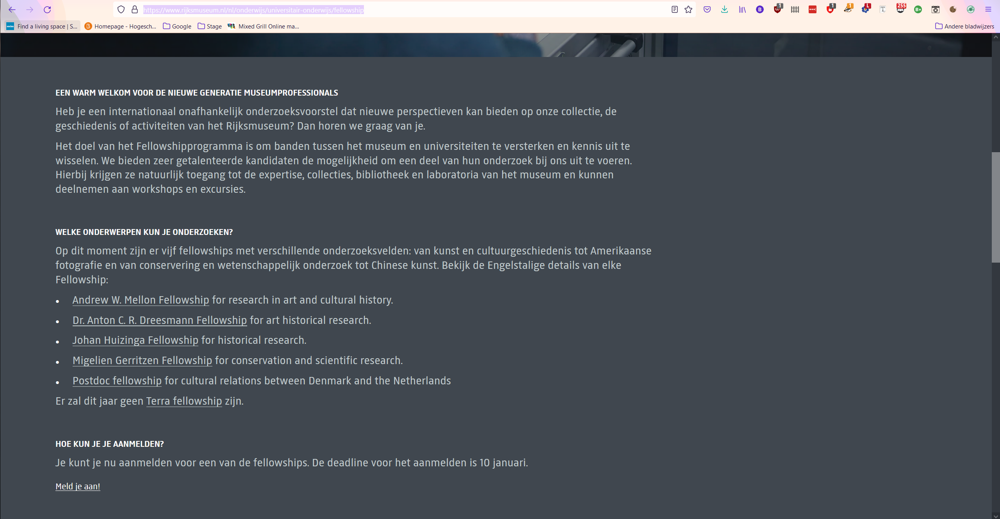

# Procesverslag
Markdown is een simpele manier om HTML te schrijven.  
Markdown cheat cheet: [Hulp bij het schrijven van Markdown](https://github.com/adam-p/markdown-here/wiki/Markdown-Cheatsheet).

Nb. De standaardstructuur en de spartaanse opmaak van de README.md zijn helemaal prima. Het gaat om de inhoud van je procesverslag. Besteedt de tijd voor pracht en praal aan je website.

Nb. Door *open* toe te voegen aan een *details* element kun je deze standaard open zetten. Fijn om dat steeds voor de relevante stuk(ken) te doen.

## Jij

uitwerken voor kick-off werkgroep

### Auteur:
Bern de Klerk (vervangen door jouw naam)

#### Je startniveau:
Blauw (kies uit zwart, rood óf blauw)

#### Je focus:
Surface (kies uit responsive óf surface plane)
 

## Je website

uitwerken voor kick-off werkgroep

### Je opdracht:
Rijksmuseum.nl

#### Screenshot(s) van de eerste pagina (small screen): 
Launchpage

#### Screenshot(s) van de tweede pagina (small screen):
Fellowship 

 

## Breakdownschets (week 1)

uitwerken na afloop 2e werkgroep

### de hele pagina: 

### dynamisch deel (bijv menu): 

## Voortgang 1 (week 2)

uitwerken voor 1e voortgang

### Stand van zaken
Het bouwen van de website gaat erg goed, het brede plaatje is aanwezig, er zijn een paar punten waar ik tegen aan loop die ik wil gaan bespreken. De kleine zoom als je over de afbeeldingen hover laat het hele plaatje groeien. Ik wil hem binnen zijn kader  laten zoomen, net als een photoshop laag. Ik wil de underscores bij de NAV items van links laten groeien, en ik wil de tickets nav items tekst zwart laten worden. 

### Agenda voor meeting
samen met je groepje opstellen

| student 1      | student 2          | student 3    | student 4        |
| ---            | ---                | ---          | ---              |
| dit bespreken  | en dit             | en ik dit    | en dan ik dat    |
| en dat ook nog | dit als er tijd is | nog een punt | dit wil ik zeker |
| ...            | ...                | ...          | ...              |

### Verslag van meeting
hier na afloop snel de uitkomsten van de meeting vastleggen

Deze meeting hebben we gewerkt aan de het hover lijntje, hetgeen wat ik erg lastig vond was om het lijntje aan de onderkant van het woord te krijgen, de oplossing was erg simpel. IPV ::Before was de oplossing ::after.

## Voortgang 2 (week 3)

uitwerken voor 2e voortgang

### Stand van zaken
Het gaat erg goed! Ik vind het nu ook leuk om te doen, de brede opzet van de website is nu af. Ik ga de footer nog verder uitbreiden en beginnen aan het menu.
In principe kan ik nu de meeste problemen oplossen zonder naar het internet te gaan, dit geeft een goed gevoel. Wellicht word ik ooit nog een waardig programmeur!

Ik wil gaan beginnen aan de tweede pagina, ik moet nog uitkiezen welke ik wil doen. Omdat ik zelf erg van kunst hou doe ik een schilderij waarschijnlijk.

### Agenda voor meeting
samen met je groepje opstellen

| student 1      | student 2          | student 3    | student 4        |
| ---            | ---                | ---          | ---              |
| Hamburger menu maken  | en dit             | en ik dit    | en dan ik dat    |
| en dat ook nog | dit als er tijd is | nog een punt | dit wil ik zeker |
| ...            | ...                | ...          | ...              |

### Verslag van meeting
hier na afloop snel de uitkomsten van de meeting vastleggen

Het hamburger menu is af, hij hoeft alleen  verder te worden vormgegeven, ik moet uitvogelen waarom ie wel werkt in mijn browser maar niet als ik hem naar github heb gepushed

## Toegankelijkheidstest (week 4)

uitwerken na test in 8e voortgang

### Bevindingen
Uit mijn testen kwamen naar voren dat de verteller die slechtziende en blinden gebruiken nog wel wat werk kan gebruiken, er waren een aantal dingen die ik wel moet verbeteren, zo missen vrijwel alle afbeeldingen de alt tag. Dit ga ik veranderen.

#### Titel eerste bevinding
De eerste test die ik heb gedaan met een bril was die voor kleurenblindheid, Adam is van zichzelf kleurenblind dus die heeft ook geholpen, hij heeft gezegd dat mijn website goed werkt en er genoeg contrast is om de website kleurenblindheidvriendelijk te maken.

#### Titel tweede bevinding. 
Uit mijn testen kwamen naar voren dat de verteller die slechtziende en blinden gebruiken nog wel wat werk kan gebruiken, er waren een aantal dingen die ik wel moet verbeteren, zo missen vrijwel alle afbeeldingen de alt tag. Dit ga ik veranderen.

## Voortgang 3 (week 4)

uitwerken voor 3e voortgang

### Stand van zaken
Voor dit voortgangsgesprek had ik in principe alles op orde, 1 dingetje waar we vast liepen was het lijntje
onder de tekst voor de items in het menu. Verder ben ik tevreden waar ik ben, maar ik moet wel haast
gaan maken dit weekend, het hamburger menu is nu af, wat een goed gevoel geeft, de opzet is nu klaar.

2 pagina's met een dropdown menu, ik ben trots op wat ik heb neergezet.

### Agenda voor meeting
samen met je groepje opstellen

| student 1      | student 2          | student 3    | student 4        |
| ---            | ---                | ---          | ---              |
| dit bespreken  | en dit             | en ik dit    | en dan ik dat    |
| en dat ook nog | dit als er tijd is | nog een punt | dit wil ik zeker |
| ...            | ...                | ...          | ...              |

### Verslag van meeting
hier na afloop snel de uitkomsten van de meeting vastleggen

- punt 1
- punt 2
- nog een punt
- ...

## Eindgesprek (week 5)

uitwerken voor eindgesprek

### Stand van zaken
Tegen het einde van het project aan merkte ik toch dat ik flink wat tijd tekort kom, ik heb enorm veel gedaan
dus aan mijn werkethiek ligt het niet, maar het lag vooral aan de onderschatting van het aantal werk wat er na
de 2 pagina's gebeurd moet worden. Ik ging voor de surface plane.

Lang verhaal kort, ik had gewoon tijd te kort.

-De dingen die ik nog wilde toevoegen zijn een light/dark mode.
-Advanced positioning. (Gelukt)
-Video (Gelukt)
-Meer micto interacties.
-Het instellen van lettergrote
-Custom themes  (Dit zou leuk zijn om verschillende kunstwerken overeen te laten komen met het thema.)

Alhoewel ik voor de herkansing ga, ben ik erg trots op wat ik wel heb gemaakt. Ik heb veel geleerd en 
ben van gedachten veranderd over wat ik vind van coderen. Ik vind het zelfs best wel leuk, het enige 
wat ik jammer vind is dat ik niet genoeg tijd had, maarja, niks aan te doen verder.
### Screenshot(s)

## Herkansing

Voor de herkansing heb ik alle zeilen bijgezet. Omdat ik eerst niet genoeg tijd had ik het niet gehaald.
Nu ben ik er vrij van overtuigd dat ik het nu wel ga halen. Ik heb van alle kleuren custom properties gemaakt.

Verder heb ik de surface plane elementen toegevoegd. Dit zijn:
-Video
-Custom theme
-Het instellen van lettergrootte 
-SVG iconen gestyled en geanimeerd
-Meer micro interacties 
-Advanced positioning

En tot op zekere hoogte toegankelijkheid.

Ik ben blij wat ik heb neergezet en ben trots op mijn werk desondanks de beoordeling.

## Bronnenlijst

continu bijhouden terwijl je werkt

Nb. Wees specifiek ('css-tricks' als bron is bijv. niet specifiek genoeg).

1. bron 1
2. bron 2
3. ...

